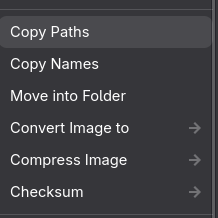
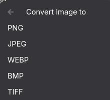
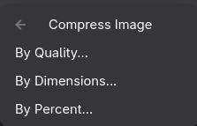
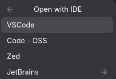
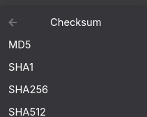

# Nautilus File Menu

[中文](README_zh.md)

A feature-rich right-click context menu extension for Nautilus (GNOME Files).

**Note⚠️: Only tested on Gnome 50**

## Features

### Copy Operations
- **Copy Path** — Copy the absolute file/folder path to clipboard
- **Copy URI** — Copy the file URI (`file:///...`)
- **Copy Name** — Copy the file name
- **Copy Content** — Copy the content of text files

### Folder Operations
- **Dissolve Folder** — Move all files from a folder to its parent directory, then delete the empty folder
- **Move into Folder** — Create a new folder and move all selected files into it (dialog prompt for folder name)

### Open with IDE
- Auto-detects installed IDEs, with support for:
  - VSCode (`code`)
  - VSCode Insiders (`code-insiders`)
  - Code - OSS (`code-oss`)
  - Zed (`zed`)
  - JetBrains IDEs (IntelliJ IDEA, PyCharm, CLion, WebStorm, etc.)
- Flatpak fallback for VSCode and Zed
- Non-IDE files (media, archives, images) are excluded from this menu

### Image Format Conversion
- Select image files, then use the "Convert Image to" submenu
- Supported formats: PNG, JPEG, WEBP, BMP, TIFF
- Powered by Pillow
- Batch conversion for multiple selected images

### Image Compression
- **By Quality** — Compress by quality percentage (1–100)
- **By Dimensions** — Resize to specified width × height (original size shown as default)
- **By Percent** — Resize by percentage (1–100%)
- Batch compression for multiple selected images

### Checksum
- Select files, then use the "Checksum" submenu
- Supported algorithms: MD5, SHA1, SHA256, SHA512 (configurable)
- Results are automatically copied to clipboard

## Screenshoot



## Installation

### Dependencies

```bash
# Arch Linux
sudo pacman -S python-nautilus python-gobject python-pillow

# Ubuntu / Debian
sudo apt install python3-nautilus python3-gi python3-pil

# Fedora
sudo dnf install nautilus-python python3-gobject python3-pillow
```

### Install

```bash
git clone <repo-url>
cd nautilus-file-menu
make install
nautilus -q  # Restart Nautilus
```

### Uninstall

```bash
make uninstall
nautilus -q
```

## Configuration

Edit `config.json` (installed at `~/.local/share/nautilus-python/extensions/nautilus-file-menu/config.json`):

```json
{
  "items": {
    "path": true,
    "uri": true,
    "name": true,
    "content": true,
    "dissolve_folder": true,
    "move_into_folder": true,
    "open_ide": true,
    "image_convert": true,
    "image_compress": true,
    "checksum": true
  },
  "shortcuts": {
    "path": "<Ctrl><Shift>C",
    "uri": "<Ctrl><Shift>U",
    "name": "<Ctrl><Shift>D",
    "content": "<Ctrl><Shift>G"
  },
  "ide_commands": {
    "vscode": "code",
    "code-insiders": "code-insiders",
    "code-oss": "code-oss",
    "zed": "zed"
  },
  "flatpak_ids": {
    "vscode": "com.visualstudio.code",
    "code-insiders": "com.visualstudio.code.insiders",
    "code-oss": "com.visualstudio.code-oss",
    "zed": "dev.zed.Zed"
  },
  "jetbrains_commands": {
    "IntelliJ IDEA": "idea",
    "PyCharm": "pycharm",
    "CLion": "clion"
  },
  "image_formats": ["PNG", "JPEG", "WEBP", "BMP", "TIFF"],
  "checksum_algorithms": ["md5", "sha1", "sha256", "sha512"]
}
```

### Configuration Notes

- **`items`** — Toggle which menu items appear in the context menu
- **`ide_commands`** — Binary names for IDE detection (searched in PATH, `~/.local/bin`, `/usr/local/bin`, `/usr/bin`)
- **`flatpak_ids`** — Flatpak app IDs as fallback when native binary is not found
- **`jetbrains_commands`** — Binary names for JetBrains IDEs (also searches JetBrains Toolbox install directories)
- **`image_formats`** — Formats available in the "Convert Image to" submenu
- **`checksum_algorithms`** — Hash algorithms available in the "Checksum" submenu

## Keyboard Shortcuts

| Action       | Shortcut         |
|--------------|------------------|
| Copy Path    | Ctrl + Shift + C |
| Copy URI     | Ctrl + Shift + U |
| Copy Name    | Ctrl + Shift + D |
| Copy Content | Ctrl + Shift + G |

## Supported Languages

- English
- Chinese

## References

- [nautilus-copy-path](https://github.com/chr314/nautilus-copy-path)
- [nautilus-open-in-code](https://github.com/GustavoWidman/nautilus-open-in-ptyxis/blob/open-in-code/nautilus-open-in-code.py)
- [python-nautilus](https://github.com/GNOME/python-nautilus)

## License

MIT
