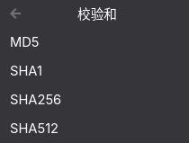

# Nautilus File Menu

[English](README.md)

一个功能丰富的 Nautilus (GNOME Files) 右键菜单扩展。

注意⚠️：仅在 Gnome 50 上测试过

## 功能

### 复制操作
- **复制路径** — 复制文件/文件夹的绝对路径到剪贴板
- **复制 URI** — 复制文件的 URI（`file:///...`）
- **复制文件名** — 复制文件名
- **复制内容** — 复制文本文件的内容

### 文件夹操作
- **解散文件夹** — 将文件夹内的所有文件移动到上级目录，然后删除空文件夹
- **收进文件夹** — 创建新文件夹并将选中的多个文件移入（弹窗输入文件夹名）

### 用 IDE 打开
- 自动检测已安装的 IDE，支持：
  - VSCode (`code`)
  - VSCode Insiders (`code-insiders`)
  - Code - OSS (`code-oss`)
  - Zed (`zed`)
  - JetBrains 系列（IntelliJ IDEA、PyCharm、CLion、WebStorm 等）
- 支持 Flatpak 回退检测
- 媒体文件、压缩包、图片等非 IDE 文件类型自动排除

### 图像格式转换
- 选中图片文件后，使用"图像转换为"子菜单
- 支持格式：PNG、JPEG、WEBP、BMP、TIFF
- 使用 Pillow 库进行转换
- 支持多选图片批量转换

### 图像压缩
- **按质量压缩** — 按质量百分比 (1–100) 压缩
- **按尺寸缩放** — 输入目标宽高（显示原始尺寸作为默认值）
- **按百分比缩放** — 按百分比 (1–100%) 缩放
- 支持多选图片批量压缩

### 校验和
- 选中文件后，使用"校验和"子菜单
- 支持算法：MD5、SHA1、SHA256、SHA512（可在配置中调整）
- 计算结果自动复制到剪贴板

## 截图



## 安装

### 依赖

```bash
# Arch Linux
sudo pacman -S python-nautilus python-gobject python-pillow

# Ubuntu / Debian
sudo apt install python3-nautilus python3-gi python3-pil

# Fedora
sudo dnf install nautilus-python python3-gobject python3-pillow
```

### 安装扩展

```bash
git clone <repo-url>
cd nautilus-file-menu
make install
nautilus -q  # 重启 Nautilus
```

### 卸载

```bash
make uninstall
nautilus -q
```

## 配置

编辑 `config.json`（安装后位于 `~/.local/share/nautilus-python/extensions/nautilus-file-menu/config.json`）：

```json
{
  "items": {
    "path": true,
    "uri": true,
    "name": true,
    "content": true,
    "dissolve_folder": true,
    "move_into_folder": true,
    "open_ide": true,
    "image_convert": true,
    "image_compress": true,
    "checksum": true
  },
  "shortcuts": {
    "path": "<Ctrl><Shift>C",
    "uri": "<Ctrl><Shift>U",
    "name": "<Ctrl><Shift>D",
    "content": "<Ctrl><Shift>G"
  },
  "ide_commands": {
    "vscode": "code",
    "code-insiders": "code-insiders",
    "code-oss": "code-oss",
    "zed": "zed"
  },
  "flatpak_ids": {
    "vscode": "com.visualstudio.code",
    "code-insiders": "com.visualstudio.code.insiders",
    "code-oss": "com.visualstudio.code-oss",
    "zed": "dev.zed.Zed"
  },
  "jetbrains_commands": {
    "IntelliJ IDEA": "idea",
    "PyCharm": "pycharm",
    "CLion": "clion"
  },
  "image_formats": ["PNG", "JPEG", "WEBP", "BMP", "TIFF"],
  "checksum_algorithms": ["md5", "sha1", "sha256", "sha512"]
}
```

### 配置说明

- **`items`** — 控制右键菜单中显示哪些功能项
- **`ide_commands`** — IDE 的可执行文件名（按顺序搜索 PATH、`~/.local/bin`、`/usr/local/bin`、`/usr/bin`）
- **`flatpak_ids`** — Flatpak 应用 ID，作为原生命令找不到时的回退方案
- **`jetbrains_commands`** — JetBrains IDE 的可执行文件名（同时搜索 JetBrains Toolbox 安装目录）
- **`image_formats`** — "图像转换为"子菜单中显示的格式列表
- **`checksum_algorithms`** — "校验和"子菜单中显示的哈希算法

## 键盘快捷键

| 操作       | 快捷键           |
|------------|------------------|
| 复制路径   | Ctrl + Shift + C |
| 复制 URI   | Ctrl + Shift + U |
| 复制文件名 | Ctrl + Shift + D |
| 复制内容   | Ctrl + Shift + G |

## 已支持语言

- 英语
- 中文

## 参考项目

- [nautilus-copy-path](https://github.com/chr314/nautilus-copy-path)
- [nautilus-open-in-code](https://github.com/GustavoWidman/nautilus-open-in-ptyxis/blob/open-in-code/nautilus-open-in-code.py)

## 许可证

MIT
